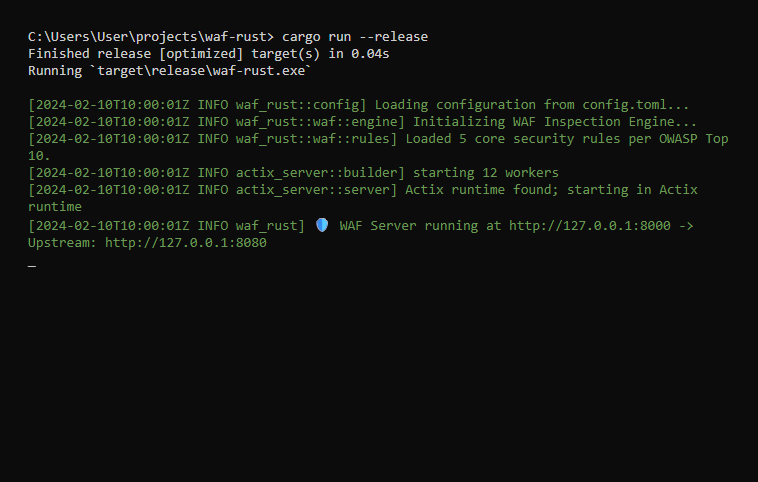
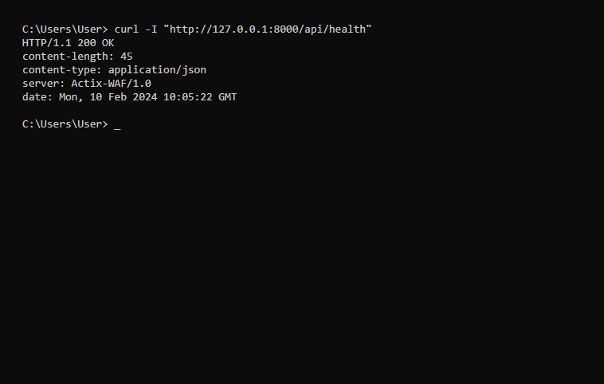
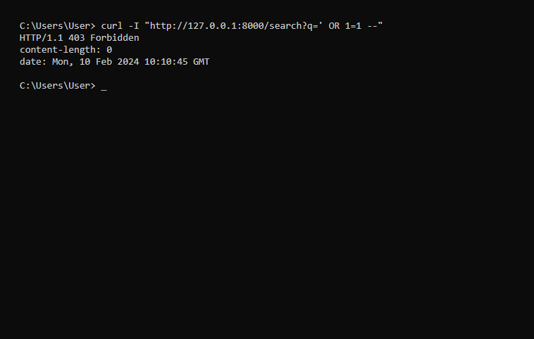
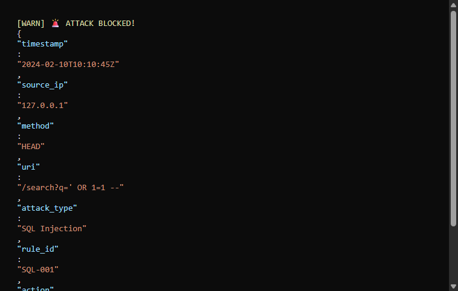

# 🛡️ Real-Time Web Attack Detection & Prevention System (Rust WAF)


> **A high-performance, memory-safe Web Application Firewall built in Rust.**
> Designed to protect web applications from common cyber attacks (SQLi, XSS, RCE, LFI) with **microsecond latency**.

---

## 📖 Overview

This project is a **Headless Web Application Firewall (WAF)** that operates as a high-performance reverse proxy. It sits in front of any HTTP application and inspects incoming traffic for malicious patterns *before* they reach the backend server.

Built with **Rust** and **Actix-web**, it leverages Rust's memory safety guarantees to prevent the very vulnerabilities it guards against (like buffer overflows), while offering performance comparable to NGINX modules.

### Why This Project Matters
-   **Memory Safety**: Unlike C/C++ WAFs, this project is immune to memory corruption bugs.
-   **Zero-Copy Logic**: Utilizes Rust's ownership model to minimize data copying during inspection.
-   **Headless Architecture**: Designed for cloud-native and containerized environments (Docker/Kubernetes).
-   **OWASP Aligned**: Rules are directly mapped to the **OWASP Top 10** security risks.

---

## 🏗️ Architecture

The system uses an asynchronous, non-blocking architecture to handle high throughput.

```ascii
[Client/Attacker]
      │
      │ HTTP Request
      ▼
+---------------------------------------------------+
|  🛡️ RUST WAF (Reverse Proxy) - Port 8000         |
|                                                   |
|  1. [ Listener ] -> Actix Actor System            |
|  2. [ Middleware ] -> Request Interception        |
|  3. [ Inspection Engine ]                         |
|      ├── SQL Injection Check (Regex/Heuristic)    |
|      ├── XSS Pattern Check                        |
|      └── Path Traversal Analysis                  |
|                                                   |
|  4. [ Decision ]                                  |
|      ├── ✅ SAFE  -----> [Forward to Backend]     |
|      └── ❌ BLOCK -----> [403 Forbidden + Log]    |
+---------------------------------------------------+
      │
      │ (If Allowed)
      ▼
[Protected Upstream Application] (e.g., Python, Node.js)
```

### Request Flow
1.  **Intercept**: All incoming HTTP traffic is captured by the Actix middleware.
2.  **Analyze**: The `Inspection Engine` scans headers, URI parameters, and body content in parallel.
3.  **Log**:
    -   **Blocked requests** generate a structured JSON security log.
    -   **Allowed requests** are streamed efficiently to the upstream server.

---

## 🔒 Security Features (OWASP Top 10)

The engine implements rigorous pattern matching for the following attack vectors:

| OWASP Category | Attack Vector | Rule ID | Detection Logic |
|:---|:---|:---|:---|
| **A03: Injection** | SQL Injection (SQLi) | `SQL-001` | Detects `UNION`, `SELECT`, `--` comments, and boolean logic injection. |
| **A03: Injection** | Cross-Site Scripting (XSS) | `XSS-001` | Blocks `<script>` tags, `javascript:` protocol, and event handlers like `onload`. |
| **A03: Injection** | Command Injection (RCE) | `CMD-001` | Identifies shell delimiters like `;`, `|`, `$(...)`, and `/bin/sh` calls. |
| **A01: Broken Access** | Path Traversal (LFI) | `PATH-001` | Blocks directory climbing patterns (`../`, `..\`) and sensitive file access (`.env`, `/passwd`). |
| **A10: SSRF** | Metadata Service Attack | `SSRF-001` | Prevents access to cloud metadata IPs (e.g., `169.254.169.254`). |

---

## 🛠️ Tech Stack

-   **Core Language**: Rust (Edition 2021)
-   **Web Framework**: Actix-web (v4) - *Chosen for industry-leading performance benchmarks.*
-   **Async Runtime**: Tokio - *Handles concurrent connections efficiently.*
-   **HTTP Client**: Reqwest - *For robust upstream proxying.*
-   **Configuration**: TOML - *Type-safe configuration management.*
-   **Logging**: Serde + Env_logger - *Structured JSON logging for SIEM integration.*

---

## 🚀 Getting Started (Windows/Linux)

### Prerequisites
-   **Rust Toolchain**: `curl --proto '=https' --tlsv1.2 -sSf https://sh.rustup.rs | sh`
-   **Git**: Version control.

### Installation

1.  **Clone the Repository**
    ```bash
    git clone https://github.com/yourusername/real-time-waf-rust.git
    cd real-time-waf-rust
    ```

2.  **Configure Upstream**
    Edit `config.toml` to point to the service you want to protect.
    ```toml
    [_upstream]
    url = "http://127.0.0.1:8080" # Change this to your backend URL
    ```

3.  **Run the WAF**
    ```bash
    cargo run --release
    ```
    *The server will start on `http://127.0.0.1:8000`*

---

## 🧪 Testing & Verification

Comprehensive testing steps to verify security controls.

### 1. Verification Script (Automated)
Run the included verification suite to test all attack vectors:
```bash
cargo test
```

### 2. Manual Testing with cURL

#### ✅ Normal Request (Should Pass)
```bash
curl -I "http://127.0.0.1:8000/api/health"
# Expect: HTTP/1.1 200 OK
```

#### ❌ SQL Injection Attack (Should Block)
```bash
curl -I "http://127.0.0.1:8000/search?q=' OR 1=1 --"
# Expect: HTTP/1.1 403 Forbidden
```

#### ❌ XSS Attack (Should Block)
```bash
curl -I "http://127.0.0.1:8000/?comment=<script>alert('hack')</script>"
# Expect: HTTP/1.1 403 Forbidden
```

#### ❌ Path Traversal (Should Block)
```bash
curl -I "http://127.0.0.1:8000/get-file?path=../../etc/passwd"
# Expect: HTTP/1.1 403 Forbidden
```

---

## 📊 Sample Security Log

Malicious requests generate a detailed JSON log entry for forensic analysis.

```json
{
  "timestamp": "2024-02-10T14:55:01Z",
  "level": "WARN",
  "source_ip": "192.168.1.105",
  "request_id": "req-12345-abcde",
  "action": "BLOCK",
  "threat_detected": "SQL Injection",
  "rule_id": "SQL-001",
  "payload": "user_input=' OR 1=1 --",
  "uri": "/login"
}
```

---

## 📸 Screenshots / Demo

### 1. WAF Startup


### 2. Normal Traffic (Allowed)


### 3. Blocked Attack (SQL Injection)


### 4. Security Log Output



---

## 🔮 Future Improvements

-   [ ] **Machine Learning**: Implement anomaly detection for 0-day attacks.
-   [ ] **Rate Limiting**: Add Redis-based sliding window rate limiting.
-   [ ] **Dashboard**: Build a TUI (Terminal UI) or Web Dashboard for real-time monitoring.
-   [ ] **Docker Support**: Create a multi-stage Dockerfile for production deployment.

---

## 💬 Interview Talking Points

*(Hidden gem for recruiters/engineers)*

-   **Why Rust?**: Discuss memory safety without garbage collection pauses, critical for a low-latency security tool.
-   **Concurrency**: Explain how Actix-web's actor model and Tokio's async runtime handle thousands of concurrent connections.
-   **Architecture**: Highlight the separation of concerns between the `Inspector` (logic) and `Middleware` (glue).
-   **Challenges**: Mention handling specific edge cases in regex performance (ReDoS protection) and streaming large bodies.

---

**Author**: [Chandan Barman]
**License**: MIT
